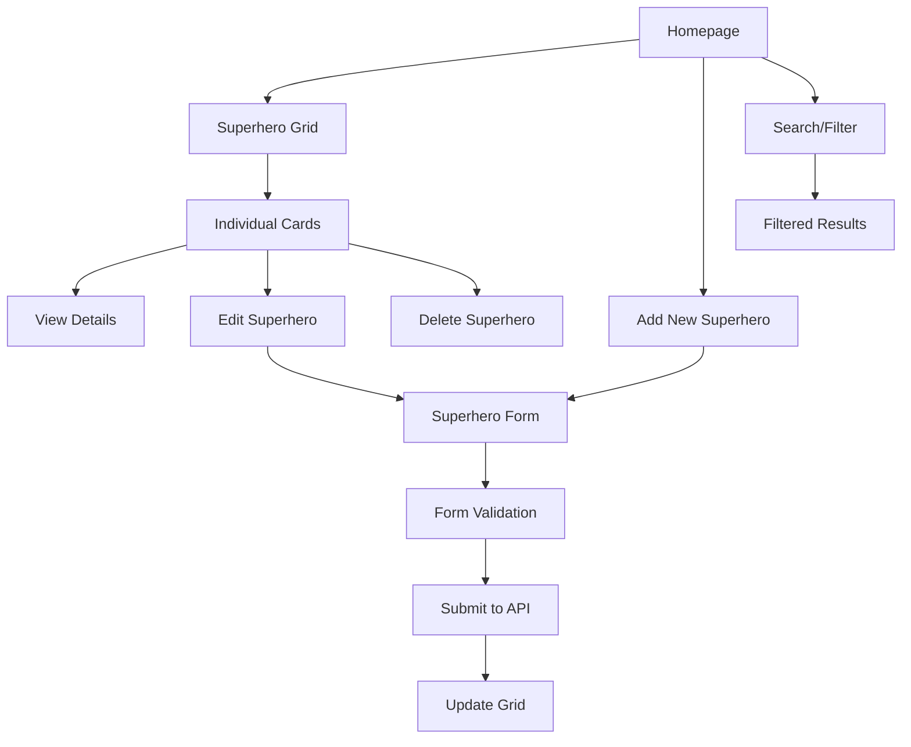

# Superheroes Directory - Technical Architecture

## Project Overview
A full-stack web application for managing a superheroes database with CRUD operations, featuring a React frontend and Express.js backend with MongoDB.

## Technology Stack

### Frontend
- **Framework**: React 19 with TypeScript
- **Build Tool**: Vite
- **Styling**: Tailwind CSS + DaisyUI
- **State Management**: React hooks (useState, useEffect)
- **HTTP Client**: Fetch API

### Backend
- **Runtime**: Node.js
- **Framework**: Express.js
- **Database**: MongoDB with Mongoose ODM
- **Middleware**: CORS, Express JSON parser
- **Environment**: dotenv for configuration

## Data Model

### Superhero Schema
```typescript
interface Superhero {
  _id: string;
  name: string;
  realName: string;
  powers: string[];
  originStory: string;
  imageUrl: string;
  alignment: 'hero' | 'villain';
  universe: 'marvel' | 'dc' | 'other';
  createdAt: Date;
  updatedAt: Date;
}
```

## API Endpoints

### REST API Structure
```
GET    /api/superheroes          # Get all superheroes
GET    /api/superheroes/:id      # Get superhero by ID
POST   /api/superheroes          # Create new superhero
PUT    /api/superheroes/:id      # Update superhero
DELETE /api/superheroes/:id      # Delete superhero
```

## Frontend Architecture

### Component Structure
```
src/
├── components/
│   ├── SuperheroCard.tsx        # Individual superhero card
│   ├── SuperheroGrid.tsx        # Grid layout for cards
│   ├── SuperheroForm.tsx        # Form for add/edit
│   ├── SearchFilter.tsx         # Search and filter controls
│   └── ConfirmDialog.tsx        # Delete confirmation modal
├── hooks/
│   ├── useSuperheroes.ts        # Custom hook for API calls
│   └── useForm.ts               # Form handling hook
├── types/
│   └── superhero.ts             # TypeScript interfaces
├── utils/
│   └── api.ts                   # API utility functions
└── App.tsx                      # Main application component
```

### Key Features
1. **Responsive Grid Layout**: Cards adapt to screen size
2. **Real-time CRUD**: Immediate UI updates after operations
3. **Search & Filter**: By name, alignment, and universe
4. **Form Validation**: Client-side validation with error messages
5. **Loading States**: Skeleton loaders and spinners
6. **Error Handling**: User-friendly error messages

## Backend Architecture

### File Structure
```
superheroes-backend/
├── models/
│   └── Superhero.js             # Mongoose schema
├── routes/
│   └── superheroes.js           # API routes
├── middleware/
│   └── errorHandler.js          # Error handling middleware
├── config/
│   └── database.js              # MongoDB connection
├── seeds/
│   └── superheroes.js           # Sample data
└── server.js                    # Main server file
```

### Database Design
- **Collection**: `superheroes`
- **Indexes**: Name (text search), alignment, universe
- **Validation**: Required fields, enum constraints
- **Timestamps**: Automatic createdAt/updatedAt

## User Interface Flow



## Development Workflow

### Phase 1: Backend Setup
1. Initialize Express server
2. Configure MongoDB connection
3. Create Superhero model
4. Implement CRUD API endpoints
5. Add sample data

### Phase 2: Frontend Foundation
1. Set up React components structure
2. Create superhero card component
3. Implement API integration
4. Add basic styling

### Phase 3: CRUD Operations
1. Create add superhero form
2. Implement edit functionality
3. Add delete with confirmation
4. Test all operations

### Phase 4: Enhanced Features
1. Add search and filtering
2. Implement loading states
3. Add form validation
4. Polish UI/UX

## Security Considerations
- Input validation on both client and server
- Sanitize user inputs to prevent XSS
- Rate limiting for API endpoints
- Environment variables for sensitive data

## Performance Optimizations
- Lazy loading for images
- Debounced search functionality
- Pagination for large datasets
- Optimistic UI updates

## Testing Strategy
- Manual testing of all CRUD operations
- Cross-browser compatibility testing
- Responsive design testing
- API endpoint testing with sample data